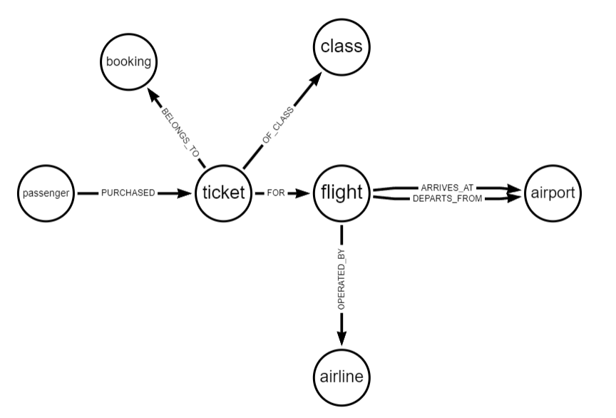
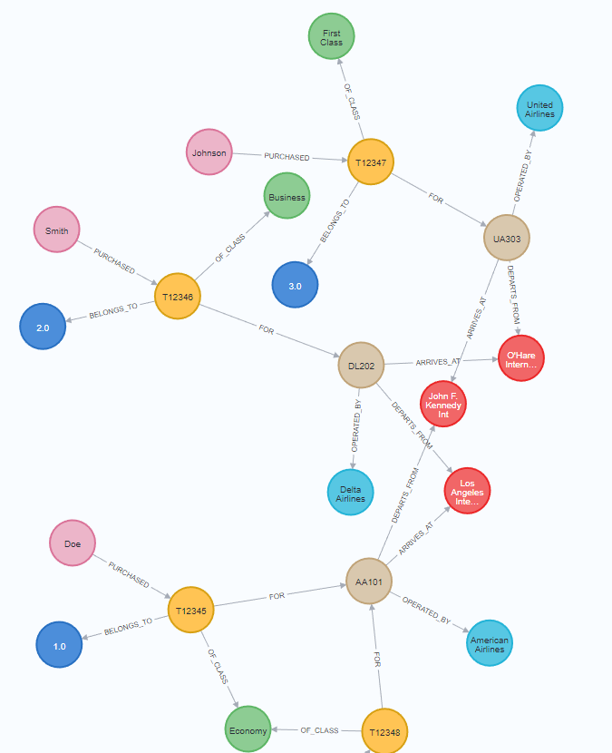

# Migration script:
Migrates data from MySQL to MongoDB and to Neo4j database.

Usage:

Run:
- MySQL server
- MongoDB server
- Neo4j server

Run sql scripts in MySQL server:
- create-db.sql
- insert-statements.sql

Run the migration script:
```bash
npm start
```

## MySQL ERD:


## MongoDB Design - Collections:
You can see the examples of the collections in the `src/collections-examples` folder where each collection is represented by a json document:
- airlines.json
- airports.json
- bookings.json
- flights.json
- passengers.json

Example of passenger document - with embedded documents:
```json
{
  "passenger_id": 1,
  "first_name": "John Doe",
  "last_name": "Doe",
  "tickets": [
    {
      "ticket_id": 1,
      "ticket_number": "1234567890",
      "price": 100.0,
      "confirmation_number": "ABC123",
      "class": {
        "class_id": 1,
        "name": "First Class"
      },
      "flight": {
        "flight_id": 1,
        "flight_number": "AA123",
        "departure_time": "2015-01-01T12:00:00Z",
        "arrival_time": "2015-01-01T13:00:00Z",
        "airline": {
          "airline_id": 1,
          "name": "American Airlines",
          "code": "AA"
        },
        "arrival_airport": {
          "airport_id": 1,
          "name": "Los Angeles International Airport",
          "code": "LAX"
        },
        "departure_airport": {
          "airport_id": 2,
          "name": "San Francisco International Airport",
          "code": "SFO"
        }
      }
    }
  ]
}
```


## Neo4j Design - Graph:


## Neo4j Data example:


## Cypher queries examples:

```cypher
// Get all airports that are not used as departure or arrival
MATCH (a:Airport)
WHERE NOT (a)<-[:DEPARTS_FROM]-(:Flight) AND NOT (a)<-[:ARRIVES_AT]-(:Flight)
RETURN a;

// Get bookings with more than one ticket
MATCH (b:Booking)<-[:BELONGS_TO]-(t:Ticket)
WITH b, COUNT(t) AS ticketCount
WHERE ticketCount > 1
RETURN b, ticketCount;

// Query flight classes and count how many times they were used in tickets, including those not used at all
MATCH (fc:FlightClass)
OPTIONAL MATCH (fc)<-[:OF_CLASS]-(t:Ticket)
WITH fc, COUNT(t) AS ticketCount
RETURN fc.name AS FlightClassName, ticketCount
 ORDER BY ticketCount DESC;

// Update Data

// Update the Name of an Airline
MATCH (a:Airline { name: 'American Airlines' })
 SET a.name = 'American Airlines Inc.'
RETURN a;

// Update the Departure Time of a Flight
MATCH (f:Flight { number: 'AA101' })
 SET f.departureDateTime = '2023-10-01T11:00:00'
RETURN f;

// Delete Data

// Delete a Specific Ticket
MATCH (t:Ticket { ticketNumber: 'T12345' })
DETACH DELETE t;

// Delete a Specific Passenger
MATCH (p:Passenger { firstName: 'John', lastName: 'Doe' })
DETACH DELETE p;
```

## TODO
- There is a typo in the passengers table in MySQL. fist_name should be first_name. 
- Numbers are passed with a decimal point to neo4j. Needs to be fixed.
- Create some test cypher queries.